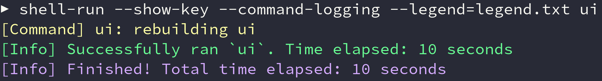
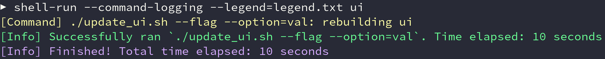

<div align="center">

# Shell-Run


</div>

---

### Table of Contents
- [Motivation](#motivation)
- [Introduction](#introduction)
- [Options](#options)
  - [Timeout](#timeout)
  - [Legend](#legend)
  - [Command-Logging](#command-logging)
  - [Show-Key](#show-key)
- [Building](#building)
  - [Cabal](#cabal)
  - [Stack](#stack)
  - [Nix](#nix)
- [Tests](#tests)

# Motivation

`shell-run` was borne out of frustration when running shell commands. Say, for instance, you run several commands on a regular basis, e.g., updates after pulling the latest code. You can run these manually like:

```sh
cmd1
cmd2
cmd3
...
```

But that can be a lot of repetitive typing, especially when the commands are longer. Thus you write an alias:

```sh
alias run_commands="cmd1 && cmd2 && cmd3 ..."
```

All well and good, but this approach has several deficiencies:

1. You do not receive any information about how long your commands have been running. If any of the commands are long-lived, how do you know when it's been "too long" and you should cancel them? You can look at a clock or use a stopwatch, but that requires you to remember every time you run the command, which is certainly unsatisfying.

1. These commands are all run synchronously even though there may be no relation between them. E.g., if you have two commands that each take 5 minutes, the combination will take 10 minutes. This is usually unnecessary.

1. Related to above, if any command fails then subsequent ones will not be run. This can be frustrating, as you may kick off a run and leave, only to return and find out that later, longer-running commands never ran because of some trivial error in the beginning.

1. It does not scale. Imagine you have variations of `cmd3` you want to run under different circumstances. You could create multiple aliases:

        
        alias run_commands_cmd3a="cmd1 && cmd2 && cmd3a"
        alias run_commands_cmd3b="cmd1 && cmd2 && cmd3b"

    But this is messy and grows exponentially in the number of aliases for each variation.

`shell-run` purports to overcome these limitations.

# Introduction

`shell-run` has the following usage:
```text
Usage: shell-run [-l|--legend PATH] [-t|--timeout VAL] [-c|--command-logging]
                 [-k|--show-key] Commands...

Available options:
  -l,--legend PATH         Path to legend file, used for translating commands.
                           Key/value pairs have the form `key=cmd1,,cmd2,,...`,
                           i.e., keys can refer to multiple commands and refer
                           to other keys recursively. Lines starting with `#`
                           are considered comments and ignored.
  -t,--timeout VAL         Non-negative integer setting a timeout.Can either be
                           a raw number (interpreted as seconds), or a "time
                           string", e.g., 1d2h3m4s, 2h3s.
  -c,--command-logging     Adds Commands' logs (stdout+stderr) to output.
  -k,--show-key            In output, display key name over actual command if it
                           exists.
  -h,--help                Show this help text
```

In a nut-shell (😉), `shell-run` is a wrapper around running shell commands. For instance:

```sh
shell-run "some long command" "another command"
```

Will run `some long command` and `another command` concurrently.

A running timer is provided, and stdout/stderr will be updated when a command finishes/crashes, respectively.

# Options

## Timeout

A timeout can be provided via `-t <value>` or `--timeout=<value>`. The argument must be either a raw integer (interpreted as seconds), or a "time string", e.g., `1d2m3h4s`, `3h20s`.

If a timeout is provided, all integers must be non-negative. If the timeout is reached, then all remaining commands will be cancelled.


## Legend

A legend file can be specified by `-l <path/to/legend>` or `--legend=<path/to/legend>`.

Lines are formatted `<cmd_key>=<command value>` (no angle brackets).

Each line can be separated by as many new lines as desired, and comments start with a #. Command values themselves can include multiple commands delimited by two commas, and they may reference other commands. For instance, given a legend file:

```text
cmd1=echo "command one"

# recursive references
cmd2=cmd1
cmd3=cmd2

cmd4=command four

# runs 3 and 4
all=cmd3,,cmd4,,echo hi
```

Then the command

```sh
shell-run --legend=path/to/legend all "echo cat"
```

Will run `echo "command one"`, `command four`, `echo hi` and `echo cat` concurrently. A picture is worth a thousand words:


## Command-Logging

The default behavior is to swallow logs for the commands themselves. The flag `-c` or `--command-logging` enables command logging.


vs.


Note: Both the commands' `stdout` and `stderr` are treated the same, logged with the same formatting. This is because many shell programs perform redirection like `echo ... >&2` (i.e. redirect `stdout` to `stderr`). Not only does this mean we need to take both if we do not want to skip any output, but it also means it does not make sense to try to differentiate the two anymore, as that information has been lost.

Practically speaking, this does not have much effect, just that if a command dies while `--command-logging` is enabled, then the final `[Error] ...` output may not have the most relevant information, and in fact the actual error may be in the final `[Command]` log.

## Show-Key

When displaying logs pertaining to a specific command, the default behavior is to use the actual command as the name. This can make the logs cluttered if the command is long, or it can be confusing if there are multiple similar commands that only have minor syntactic differences. The flag `-k` or `--show-key` instead uses the key name for display, if one exists. For instance, for legend entry `ui=./update_ui.sh --flag --option=val`, logs will looks like



rather than the usual



Naturally, this does not affect commands that do not have a key (i.e. those not in a legend file). Also, if the commands are defined recursively, then the key name will be the _final_ key. That is, if the previous `ui` was instead run as, e.g., `all` with `all=ui,,...` in the legend file, the display would still show `ui`.

# Building

## Prerequisites

You will need one of:

* [cabal-install 2.4+](https://www.haskell.org/cabal/download.html) and one of:
  * [ghc 8.10.7](https://www.haskell.org/ghc/download_ghc_8_10_7.html)
  * [ghc 9.0.2](https://www.haskell.org/ghc/download_ghc_9_0_2.html)
  * [ghc 9.2.1](https://www.haskell.org/ghc/download_ghc_9_2_1.html)
* [stack](https://docs.haskellstack.org/en/stable/README/#how-to-install)
* [nix](https://nixos.org/download.html)

If you have never built a haskell program before, `stack` is probably the best choice.

## Cabal

You will need `ghc` and `cabal-install`. From there `shell-run` can be built with `cabal build` or installed globally (i.e. `~/.cabal/bin/`) with `cabal install`.

The project is set to build with `-Werror` in `cabal.project`, so if for some reason that's a problem, you can disable this with `cabal build --ghc-options="-Wwarn"`.

## Stack

Like `cabal`, `shell-run` can be built locally or installed globally (e.g. `~/.local/bin/`) with `stack build` and `stack install`, respectively.

## Nix

### From source

Building with `nix` uses [flakes](https://nixos.wiki/wiki/Flakes). `shell-run` can be built with `nix build`, which will compile and run the tests.

To launch a shell with various tools (e.g. `cabal`, `hls`, formatters), run `nix develop`. After that we can launch a repl with `cabal repl` or run the various tools on our code (e.g. scripts in `ci_scripts/`). At this point you could also build via `cabal`, though you may have to first run `cabal update`. This will fetch the needed dependencies from `nixpkgs`.

### Via nix

Because `shell-run` is a flake, it be built as part of a nix expression. For instance, if you want to add `shell-run` to `NixOS`, your `flake.nix` might look something like:

```nix
{
  description = "My flake";

  inputs = {
    nixpkgs.url = "nixpkgs/nixos-unstable";
    shell-run-src.url= "github:tbidne/shell-run/flakify";
    shell-run-src.inputs.nixpkgs.follows = "nixpkgs";
    # If you already have a flake-utils dependency and don't want another one.
    shell-run-src.inputs.flake-utils.follows = "flake-utils";
  };

  outputs = { self, nixpkgs, shell-run-src, ... }:
    let
      system = "x86_64-linux";
      pkgs = import nixpkgs {
        system = system;
      };
      # Remove dontCheck if you want tests to run.
      shell-run = pkgs.haskell.lib.dontCheck shell-run-src.defaultPackage.${system};
    in
    {
      nixosConfigurations = {
        nixos = nixpkgs.lib.nixosSystem {
          system = system;
          modules = [
            (import ./configuration.nix { inherit pkgs shell-run; })
          ];
        };
      };
    };
}
```

Then in `configuration.nix` you can simply have:

```nix
{ pkgs, shell-run, ... }:

{
  environment.systemPackages = [
    shell-run
  ];
}
```

# Testing

There are four test suites, `doctest`, `unit`, `integration` and `functional`. These can be run via:

```sh
# --test-show-details=direct gives nicer output
cabal test doctest --test-show-details=direct
cabal test unit --test-show-details=direct
cabal test integration --test-show-details=direct
cabal test functional --test-show-details=direct

# everything
cabal test --test-show-details=direct
```

Because the functional tests run asynchronous actions, the test output when running all suites (e.g. `cabal test`) can be wonky (out of order, non-deterministic). A workaround is to explicitly run the tests synchronously a la `cabal test -j1`.
