<div align="center">

# Shell-Run

## Run Shell Commands Concurrently

[](https://github.com/tbidne/shell-run/releases/)
[](https://opensource.org/licenses/BSD-3-Clause)


[](https://github.com/tbidne/shell-run/actions/workflows/nix_ci.yaml)
[](https://github.com/tbidne/shell-run/actions/workflows/stack_ci.yaml)
[](https://github.com/tbidne/shell-run/actions/workflows/style_ci.yaml)

[](https://github.com/tbidne/shell-run/actions/workflows/ghc_8-10.yaml)
[](https://github.com/tbidne/shell-run/actions/workflows/ghc_9.0.yaml)
[](https://github.com/tbidne/shell-run/actions/workflows/ghc_9.2.yaml)

</div>

---

### Table of Contents
- [Motivation](#motivation)
- [Introduction](#introduction)
- [Options](#options)
  - [Core Functionality](#core-functionality)
    - [Legend](#legend)
    - [Timeout](#timeout)
  - [Logging](#logging)
    - [Command Log](#command-log)
    - [File Log](#file-log)
    - [Disable Log](#disable-log)
  - [Log Formatting](#log-formatting)
    - [Key Show](#key-show)
    - [Command Name Truncation](#command-name-truncation)
    - [Command Line Truncation](#command-line-truncation)
- [Building](#building)
  - [Cabal](#cabal)
  - [Stack](#stack)
  - [Nix](#nix)

# Motivation

`shell-run` was borne of frustration. Suppose you run several shell commands on a regular basis e.g. updates after pulling the latest code. You can run these manually like:

```sh
cmd1
cmd2
cmd3
...
```

But that can be a lot of repetitive typing, especially when the commands are longer. Thus you write an alias:

```sh
alias run_commands="cmd1 && cmd2 && cmd3 ..."
```

All well and good, but this approach has several deficiencies:

1. You do not receive any information about how long your commands have been running. If any of the commands are long-lived, how do you know when it's been "too long" and you should cancel them? You can look at a clock or use a stopwatch, but that requires remembering every time you run the command, which is certainly unsatisfying.

1. These commands are all run synchronously even though there may be no relation between them. For example, if you have three commands that each take 5 minutes, the combination will take 15 minutes. This is usually unnecessary.

1. Related to above, if any command fails then subsequent ones will not be run. This can be frustrating, as you may kick off a run and leave, only to return and find out that later, longer-running commands never ran because of some trivial error in the beginning.

1. It does not scale. Imagine you have variations of `cmd3` you want to run under different circumstances. You could create multiple aliases:

        
        alias run_commands_cmd3a="cmd1 && cmd2 && cmd3a"
        alias run_commands_cmd3b="cmd1 && cmd2 && cmd3b"

    But this is messy and grows exponentially in the number of aliases for each variation.

`shell-run` purports to overcome these limitations.

# Introduction

In a nut-shell (😉), `shell-run` is a wrapper around running shell commands. For instance:

```sh
shell-run "some long command" "another command"
```

Will run `some long command` and `another command` concurrently.

A running timer is provided, and stdout/stderr will be updated when a command finishes/crashes, respectively. Example of running two commands `sign-peace-treaty` and `takeover` defined in a custom legend file:

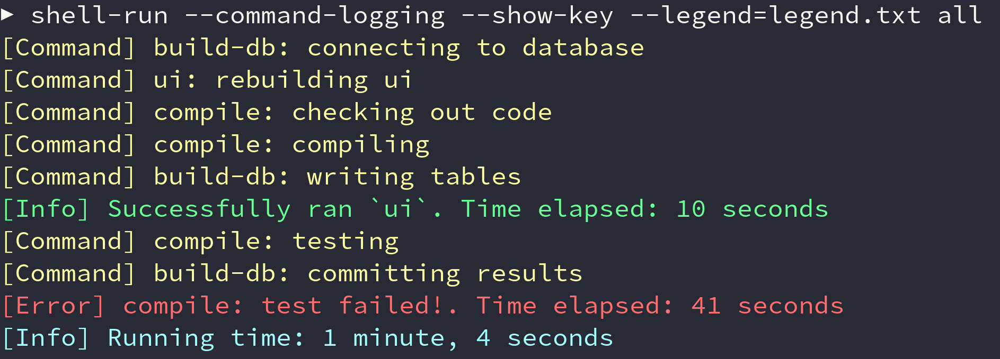

# Options

## Core Functionality

### Legend

**Arg:** `-l, --legend PATH`

**Description**: A legend file can be provided that maps key names to commands. Lines are formatted `<cmd_key>=<command value>` (no angle brackets).

Each line can be separated by as many new lines as desired, and comments start with a `#`. Command values themselves can include multiple commands delimited by two commas, and they may reference other commands.

If this option is omitted, we search for a legend file in the Xdg config directory e.g. `~/.config/shell-run/shell-run.legend`. This will not cause an error if it is not found, though there will be a log message.

**Example:** For instance, given a legend file

```text
cmd1=echo "command one"

# recursive references
cmd2=cmd1
cmd3=cmd2

cmd4=command four

# runs 3 and 4
all=cmd3,,cmd4,,echo hi
```

Then the command

```sh
shell-run --legend=path/to/legend all "echo cat"
```

Will run `echo "command one"`, `command four`, `echo hi` and `echo cat` concurrently. A picture is worth a thousand words:

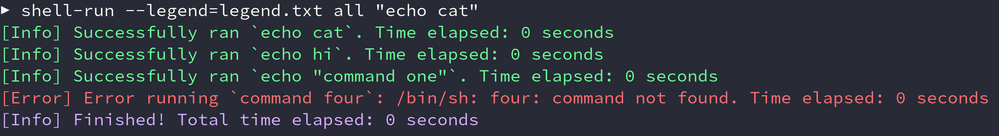

Note: duplicate keys will cause a parse error to be thrown when loading. Cyclic keys are also disallowed, though these will only throw if you actually try to execute one (i.e. merely having cyclic definitions in the legend file will not throw an error).

### Timeout

**Arg:** `-t, --timeout NATURAL`

**Description:** The provided timeout must be either a raw integer (interpreted as seconds), or a "time string" e.g. `1d2m3h4s`, `3h20s`. All integers must be non-negative. If the timeout is reached, then all remaining commands will be cancelled.

**Example:**

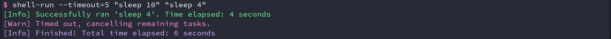

## Logging

### Command Log

**Arg:** `-c, --cmd-log`

**Description:** The default behavior is to swallow logs for the commands themselves. This flag gives each command a console region in which its logs will be printed. Only the latest log per region is show at a given time.

**Example:**

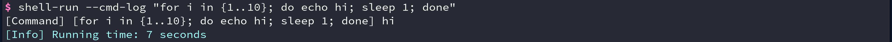

vs.

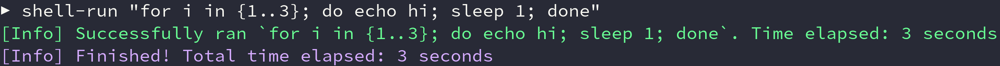

Note: Both the commands' `stdout` and `stderr` are treated the same, logged with the same formatting. This is because many shell programs perform redirection like `echo ... >&2` (i.e. redirect `stdout` to `stderr`). Not only does this mean we need to take both if we do not want to skip any output, but it also means it does not make sense to try to differentiate the two anymore, as that information has been lost.

Practically speaking, this does not have much effect, just that if a command dies while `--cmd-log` is enabled, then the final `[Error] ...` output may not have the most relevant information. See [File-Logging](#file-logging) for details on investigating command failure.

### File Log

**Arg:** `-f, --file-log PATH`

**Description**: If a path is supplied, all logs will additionally be written to the supplied file. Furthermore, command logs will be written to the file irrespective of `--cmd-log`. Console logging is unaffected. This can be useful for investigating command failures. If the string literal `default` or `d` is given, we will write to the Xdg config directory e.g. `~/.config/shell-run/shell-run.log`.

**Example:**

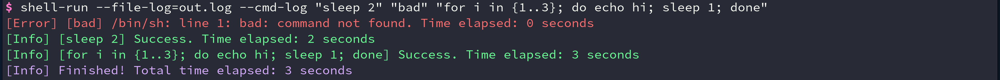
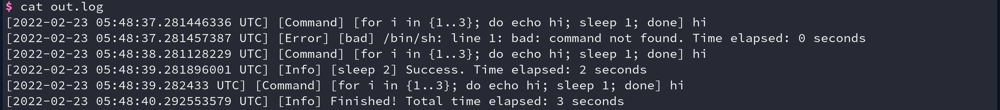

### Disable Log

**Arg:** `-d, --disable-log`

**Description**: This option globally disables all logging i.e. ordinary logs and those created via `--cmd-log` and `--file-log`. As most uses will want at the least the default success/error messages and timers, this option is primarily intended for debugging or testing where logging is undesirable.

## Log Formatting

### Key Show

**Arg:** `-k, --key-show`

**Description:** When displaying logs pertaining to a specific command, the default behavior is to use the actual command as the name. This can make the logs cluttered if the command is long, or it can be confusing if there are multiple similar commands that only have minor syntactic differences. This flag instead uses the key name for display, if one exists.

**Example:**

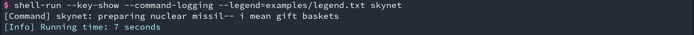
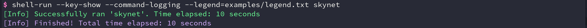

rather than the usual

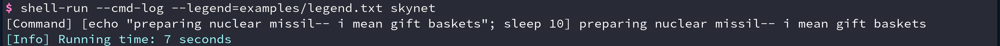
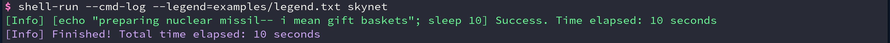

Naturally, this does not affect commands that do not have a key (i.e. those not in a legend file). Also, if the commands are defined recursively, then the key name will be the _final_ key.

### Command Name Truncation

**Arg:** `-x, --cmd-name-trunc NATURAL`

**Description:** Non-negative integer that limits the length of commands/key-names in the console logs. Defaults to no truncation. This affects everywhere the command/key-name shows up (i.e. in command logs or final success/error message). File logs created via `--file-log` are unaffected.

**Example:**

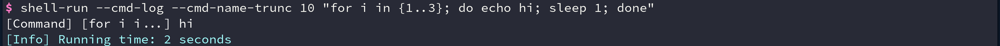
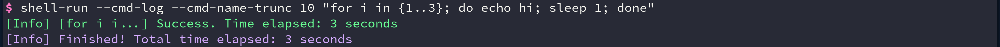

### Command Line Truncation

**Arg:** `-y, --cmd-line-trunc NATURAL or detect/d`

**Description:** Non-negative integer that limits the length of logs produced via `--cmd-log` in the console logs. Can also be the string literal `detect` or `d`, to detect the terminal size automatically. Defaults to no truncation. This does not affect file logs with `--file-log`.

**Example:**

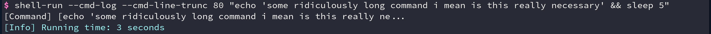


# Building

## Prerequisites

You will need one of:

* [cabal-install 2.4+](https://www.haskell.org/cabal/download.html) and one of:
  * [ghc 8.10.7](https://www.haskell.org/ghc/download_ghc_8_10_7.html)
  * [ghc 9.0.2](https://www.haskell.org/ghc/download_ghc_9_0_2.html)
  * [ghc 9.2.1](https://www.haskell.org/ghc/download_ghc_9_2_1.html)
* [stack](https://docs.haskellstack.org/en/stable/README/#how-to-install)
* [nix](https://nixos.org/download.html)

If you have never built a haskell program before, `stack` is probably the best choice.

## Cabal

You will need `ghc` and `cabal-install`. From there `shell-run` can be built with `cabal build` or installed globally (i.e. `~/.cabal/bin/`) with `cabal install`.

## Stack

Like `cabal`, `shell-run` can be built locally or installed globally (e.g. `~/.local/bin/`) with `stack build` and `stack install`, respectively.

## Nix

### From source

Building with `nix` uses [flakes](https://nixos.wiki/wiki/Flakes). `shell-run` can be built with `nix build`, which will compile and run the tests.

To launch a shell with various tools (e.g. `cabal`, `hls`), run `nix develop`. After that we can launch a repl with `cabal repl` or run the various tools on our code. At this point you could also build via `cabal`, though you may have to first run `cabal update`. This will fetch the needed dependencies from `nixpkgs`.

### Via nix

Because `shell-run` is a flake, it be built as part of a nix expression. For instance, if you want to add `shell-run` to `NixOS`, your `flake.nix` might look something like:

```nix
{
  description = "My flake";

  inputs = {
    nixpkgs.url = "nixpkgs/nixos-unstable";
    shell-run-src.url= "github:tbidne/shell-run/main";
  };

  outputs = { self, nixpkgs, shell-run-src, ... }:
    let
      system = "x86_64-linux";
      pkgs = import nixpkgs {
        system = system;
      };
      shell-run = shell-run-src.defaultPackage.${system};
      # Alternative if you want tests disabled.
      #shell-run = pkgs.haskell.lib.dontCheck shell-run-src.defaultPackage.${system};
    in
    {
      nixosConfigurations = {
        nixos = nixpkgs.lib.nixosSystem {
          system = system;
          modules = [
            (import ./configuration.nix { inherit pkgs shell-run; })
          ];
        };
      };
    };
}
```

Then in `configuration.nix` you can simply have:

```nix
{ pkgs, shell-run, ... }:

{
  environment.systemPackages = [
    shell-run
  ];
}
```
